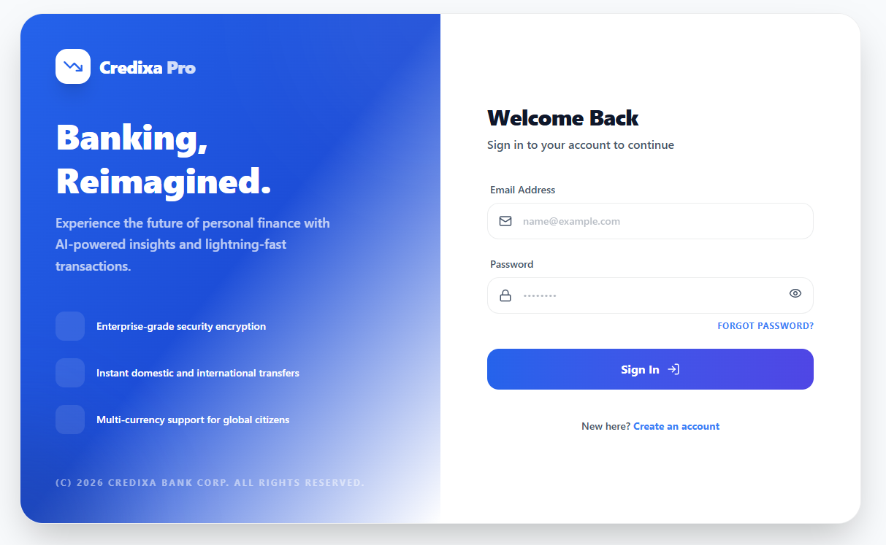

# Credixa Pro

A modern digital banking platform with real-time transactions, loan management, and an administrative dashboard.

---

## Features

### Frontend
- **Authentication**: JWT-based authentication with protected routes, OTP verification, and password reset flow
- **Dashboard**: Real-time balance overview, spending analytics, and quick actions
- **Accounts**: Multi-account support (Savings, Current, Fixed Deposit)
- **Transactions**: Deposit, withdrawal, fund transfer, transaction history, and filtering
- **Beneficiaries**: Save and manage recurring recipients with verification
- **Loans**: Loan product browsing, EMI calculator, and application tracking
- **Notifications**: Real-time alerts using WebSocket
- **Admin Panel**: User management, transaction monitoring, and system statistics
- **UI/UX**: Dark mode, responsive design, skeleton loaders, and custom toast notifications

### Backend
- **Security**: Spring Security, JWT Authentication, Role-Based Access Control (RBAC), 2FA support, account lockout protection
- **Core Banking**: ACID-compliant transactions, secure fund transfer with rollback support
- **Performance**: Redis caching, connection pooling, pagination, and sorting
- **Messaging**: Kafka-based notification events with email/SMS simulation
- **API**: Swagger/OpenAPI documentation and centralized exception handling

---

## Tech Stack

| Layer | Technology |
|-------|------------|
| **Frontend** | React 19, Vite, Redux Toolkit, Tailwind CSS, Recharts, Framer Motion |
| **Backend** | Spring Boot, MySQL, Redis, Kafka, JWT |
| **Real-time** | STOMP WebSocket, SockJS |
| **Deployment** | Docker Ready |

---

## Project Structure

```text
credixa-bank-application/
├── credixa-frontend/
│   ├── src/
│   │   ├── api/
│   │   ├── components/
│   │   ├── hooks/
│   │   ├── pages/
│   │   ├── store/
│   │   ├── utils/
│   │   └── main.jsx
│   ├── public/
│   └── package.json
└── mockup/
    ├── API design.html
    ├── SQL script.sql
    └── System design.txt
```

---

## Getting Started

### Prerequisites

- Node.js 20+
- npm or Yarn

### Installation

```bash
cd credixa-frontend
npm install
```

### Development

```bash
npm run dev      # Start development server
npm run build    # Build production bundle
npm run lint     # Run ESLint
npm run preview  # Preview production build
```

---

# UI Screenshots

## Login



---

## Dashboard


---

## Account


---

## Transfer


---

## Transactions


---

## Loan


---

# Admin

## Admin Dashboard


---

## User Management


---

## Branch Management


---

## Loan Management


---

## API Endpoints

Base URL:

```text
/api/v1
```

### Authentication

| Method | Endpoint | Description |
|--------|----------|-------------|
| POST | `/auth/register` | Register a new user |
| POST | `/auth/login` | Authenticate and receive JWT |
| POST | `/auth/verify-otp` | Verify OTP |
| POST | `/auth/forgot-password` | Send password reset OTP |
| POST | `/auth/reset-password` | Reset password using OTP |
| POST | `/auth/logout` | Logout user |
| PATCH | `/auth/2fa` | Enable/Disable Two-Factor Authentication |

### Accounts

| Method | Endpoint | Description |
|--------|----------|-------------|
| GET | `/accounts` | Get all user accounts |
| GET | `/accounts/{id}` | Get account details |
| GET | `/accounts/{id}/balance` | Get account balance |
| GET | `/accounts/summary` | Dashboard account summary |

### Transactions

| Method | Endpoint | Description |
|--------|----------|-------------|
| GET | `/transactions` | Transaction history |
| POST | `/transactions/deposit` | Deposit funds |
| POST | `/transactions/withdraw` | Withdraw funds |
| POST | `/transactions/transfer` | Transfer money |
| GET | `/transactions/statement` | Download account statement |

### Loans

| Method | Endpoint | Description |
|--------|----------|-------------|
| GET | `/loan-products` | Available loan products |
| GET | `/loans` | User loans |
| POST | `/loans/apply` | Apply for loan |
| GET | `/loans/emi-calculator` | EMI calculator |

### Admin

| Method | Endpoint | Description |
|--------|----------|-------------|
| GET | `/admin/users` | List all users |
| PATCH | `/admin/users/{id}/status` | Block/Unblock user |
| PATCH | `/admin/users/{id}/kyc` | Update KYC status |
| GET | `/admin/stats` | System statistics |
| GET | `/admin/transactions` | View all transactions |

See **mockup/API design.html** for complete API documentation.

---

## Database Schema

The database includes the following tables:

- `users`
- `admin_users`
- `accounts`
- `beneficiaries`
- `transactions`
- `loan_products`
- `loans`
- `notifications`

See **mockup/SQL script.sql** for the complete database schema.

---

## Environment Variables

Create a `.env` file inside `credixa-frontend/`.

```env
VITE_API_BASE_URL=https://api.credixa.in/api/v1
VITE_WS_URL=wss://api.credixa.in/ws
```